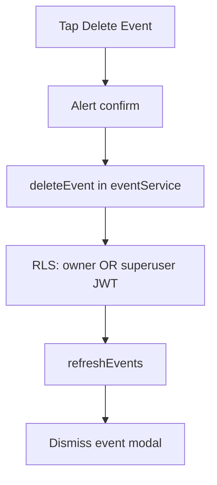

# Super user delete event (more menu)

## Context

- The overflow menu lives on the event detail modal in `[app/event/[id].tsx](app/event/[id].tsx)` (`Stack.Toolbar.Menu` with a single **Report** `MenuAction`).
- Superuser is already exposed as `isSuperUser` from `[contexts/UserContext.tsx](contexts/UserContext.tsx)` (`user?.app_metadata?.superuser === true`).
- `[services/eventService.ts](services/eventService.ts)` `deleteEvent(id, userId)` uses `.eq('user_id', userId)`, and `[supabase/migrations/001_create_events_table.sql](supabase/migrations/001_create_events_table.sql)` only allows `DELETE` when `auth.uid() = user_id`. **Deleting someone else’s event as a superuser will fail until both RLS and the service are updated.**

## UI behavior

- **Placement**: **Report** stays first; **Delete Event** appears **below** it only when `isSuperUser` is true.
- **Divider**: `Stack.Toolbar.Menu` only allows nested `Stack.Toolbar.Menu` and `Stack.Toolbar.MenuAction` (see `expo-router` `StackToolbarMenu.js`). There is no separate separator component in the public API. The supported pattern for grouped sections / separators in this stack is **nested `Stack.Toolbar.Menu` with `inline`**, which maps to UIKit inline menu sections (sections typically render with separation between them).
- **Recommended JSX structure**:
  - **Superuser**: wrap **Report** in `<Stack.Toolbar.Menu inline>…</Stack.Toolbar.Menu>`, then a second `<Stack.Toolbar.Menu inline>` containing a destructive **Delete Event** `MenuAction` (e.g. `trash` icon).
  - **Non-superuser**: keep a single flat `<Stack.Toolbar.MenuAction>` for **Report** (avoids an unnecessary one-item “section” for normal users).
- **Delete flow**: `Alert.alert` confirmation (destructive style) → call delete API → `refreshEvents()` from `[contexts/EventContext.tsx](contexts/EventContext.tsx)` → navigate away (e.g. same `handleClose` / `router.replace` pattern as the close button) and haptics on success/error.

## Backend / service

1. **New migration** (e.g. `supabase/migrations/005_superuser_delete_events.sql`):
  - Add a **second** `DELETE` policy on `events` so superusers can delete any row, e.g. `USING` a check on the JWT that mirrors the client’s `app_metadata.superuser` claim. Typical Supabase expression (verify against your project’s JWT payload in the SQL editor if needed):
   `(coalesce((auth.jwt() -> 'app_metadata' ->> 'superuser')::boolean, false) = true)`
  - RLS combines multiple policies with **OR** for the same command, so this keeps the existing owner-only policy intact.
2. `**[services/eventService.ts](services/eventService.ts)`**:
  - Extend `deleteEvent` (or add a small helper used only from the superuser path) so a superuser delete issues `delete().eq('id', id)` **without** `.eq('user_id', userId)`—RLS decides if the row is deletable.
  - Keep the existing owner-only path for normal users (current `.eq('user_id', userId)` behavior) so behavior stays explicit and predictable.

## Files to touch

| Area | File                                                                                                                 |
| ---- | -------------------------------------------------------------------------------------------------------------------- |
| UI   | `[app/event/[id].tsx](app/event/[id].tsx)` — `useUser` → `isSuperUser`, menu structure, `handleDeleteEvent`, `Alert` |
| API  | `[services/eventService.ts](services/eventService.ts)` — superuser-capable delete                                    |
| DB   | New migration under `supabase/migrations/` — superuser `DELETE` policy                                               |

## Verification

- On a **non-super** account: menu shows only **Report**; no divider-only chrome.
- On a **superuser** account: **Report** (first inline section), visual separation, **Delete Event** below; delete removes the event, list refreshes, modal closes.
- Attempting delete on another user’s event as non-super still fails (RLS + existing query).

